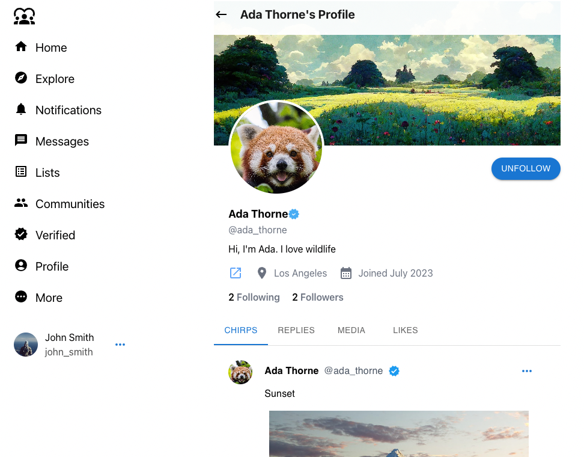

# Full Stack Microblogging Social Media Web Application

•	A full stack microblogging social media web application, which mirrors Twitter's functionality.

•	Users can sign up, log in or log out securely. On the Homepage, users can create dynamic and multimedia-rich posts, browse posts by other users, repost and like these posts and also reply to them.

•	Users can view their own profile, update profile details, view their own posts, reposts, liked posts and followers/following counts.

•	A user can view the post and all its details including replies by clicking on a post. A user can visit profiles of other users, follow/unfollow them, and view all of their posts and liked posts.

## Tech-stack (Frameworks, libraries, dependencies)
### Backend
* `Spring Boot 3.1.6` - Open-source Java-based framework  [Spring Boot Website](https://spring.io/projects/spring-boot)
* `Spring Security` - Java-based framework providing comprehensive authentication, authorization, and secure access control
* `JWT` - (JSON Web Token) is a compact, URL-safe means of representing claims between two parties [jwt dependencies](https://mvnrepository.com/artifact/io.jsonwebtoken/jjwt)
* `MySQL` - Open-source relational database management system (RDBMS) that uses structured query language (SQL) for managing and manipulating data. [MySQL Website](https://www.mysql.com/)
* `Spring Web`, `Spring Data JPA`, `Lombok`, `Jackson`

###Frontend
* `React.js` - Library for web and native user interfaces to build user interfaces out of individual pieces called components written in JavaScript. [Website](https://react.dev/)
* `MUI` - Material-UI, a React UI framework that provides pre-designed components  [website](https://mui.com/)
* `Tailwind CSS` - Utility-first CSS framework [website](https://tailwindcss.com/)
* `redux`, `react-redux` - Managing state
* `formik` -  Handling form
* `axios` - Making HTTP request from browser
* `Cloudinary` - Cloud storage of images, videos [website](https://cloudinary.com/)

### Running the project 
* Install Eclipse or Spring Tool Suite, Spring Initializr can be used to create a starter project with required dependencies for Backend. This project uses Maven, Java 17, Spring Boot 3.1.6
* Install MySQL community server, configure the root and password and make changes in the backend's application.properties file.
* Install Visual Studio Code, and install the required dependencies (react, redux, axios, etc) from the terminal. More information about dependencies can be found in the frontend folder's package.json file.
* Create a cloudinary account, configure the database and make changes in the uploadToCloudinary.js file.
* Start the backend server by running it as Spring Boot App.
* 'npm start' can be used to view the react project in the browser.

## Outputs

* Signup / Login page

-------------------------------
* Create Account

-------------------------------
* Login

* Home

* User's posts on Home

* Reply, Repost and Like a user's post on Home

* Reply to a post

* View a post by a user and all its replies

* Profile page, view your details, followers and followings counts

* View your own posts, reposts and liked posts

* Edit Profile

* View profiles of other users, follow/unfollow them, view their posts, reposts and liked posts

* Delete your post

* Logout

* Get Verified (only frontend)

